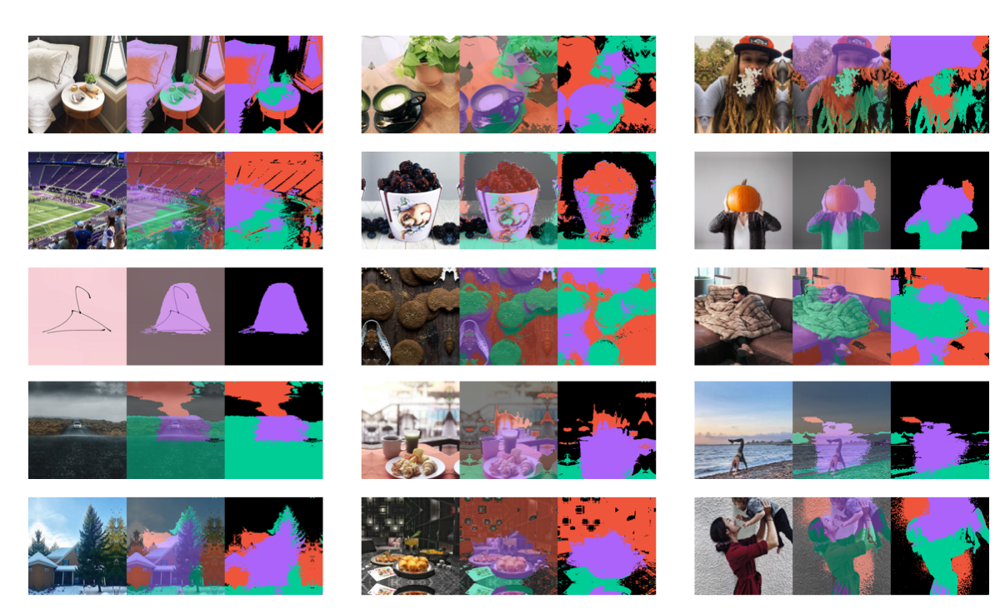

# Visual Insights on Popularity (VIP)
 [[project poster]](assets/poster.pdf)

## About
VIP is an innovative project that focuses on predicting the intrinsic popularity of images on social media platforms, without the need for additional metadata. The auxiliary objective of VIP is to provide insights into how specific parts of an image contribute to its overall popularity.

## Overview
In the age of social media, understanding the factors that drive an image's popularity is crucial for content creators, marketers, and social media influencers. VIP is built using the PyTorch framework and leverages state-of-the-art machine learning models ([ConvNeXt](https://arxiv.org/abs/2201.03545), [iBOT](https://arxiv.org/abs/2111.07832)), and adversarial training objectives to forecast the popularity of an entire image and identify key components within the image that influence its popularity.

## Example
To demonstrate the visual effects of the project, sample images with their respective meaningful parts marked with different colors are included below.

Red, green and purple colors (positive masks) indicate that selected parts positively contribute to the overall image popularity, while black (neutral mask) indicates lack of popularity contribution. 

By examining these visual insights, users can gain a deeper understanding of the factors that make an image popular on social media.

## Acknowledgments
Special thanks to Michał Szachniewicz ([szacho](https://github.com/szacho)) for providing invaluable assistance in preparing the project poster.

